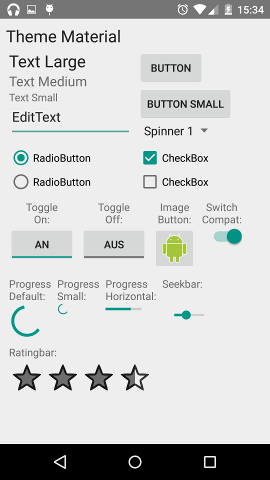

# Theme Test App
Android app for comparing various android themes

## Screenshots

Here are some example Screenshots from Nexus 5 (Android 5.0), Galaxy S5 (Android 4.4) and Desire S (Android 4.0):

The differences between Material, Holo and Classic themes are easy to see, but there are also some subtile differances for the AppCompat theme. It's a mix of Holo and Material. For example RadioButton and CheckBox have the material style, but SeekBar and ProgressBar use the Holo Style. The Devicedefault look completely different for HTC, Samsung and Google.

## Licence
    Copyright 2011-2015 Hannes Boran

    Licensed under the Apache License, Version 2.0 (the "License");
    you may not use this file except in compliance with the License.
    You may obtain a copy of the License at

       http://www.apache.org/licenses/LICENSE-2.0

    Unless required by applicable law or agreed to in writing, software
    distributed under the License is distributed on an "AS IS" BASIS,
    WITHOUT WARRANTIES OR CONDITIONS OF ANY KIND, either express or implied.
    See the License for the specific language governing permissions and
    limitations under the License.
