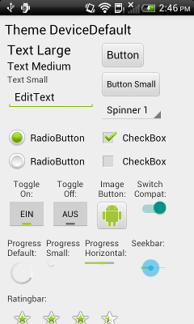

# Theme Test App
Android app for comparing various android themes. It shows the most common android ui widgets with different themes. Especially the AppCompat theme has different appearance on Android 4 and Android 5.

Demo App on Google Play: 

## Screenshots

### Nexus

Here are some example Screenshots from a Google Nexus 5 (Android 5.0) with Material, Holo and Classic themes:

The differences between Material, Holo and Classic themes are easy to see.

### Galaxy S4
Screenshots from a Samsung Galaxy S4 (Android 4.4):

Notice the differances for the AppCompat theme. It's a mix of Holo and Material. For example RadioButton and CheckBox have the material style, but SeekBar and ProgressBar use the Holo Style. Also the ripple effect on buttons is not available with AppCompat.

The Devicedefault theme looks completely different the rest.

### HTC Desire S
Screenshots from a HTC Desire S (Android 4.0):

## Licence
    Copyright 2011-2015 Hannes Boran

    Licensed under the Apache License, Version 2.0 (the "License");
    you may not use this file except in compliance with the License.
    You may obtain a copy of the License at

       http://www.apache.org/licenses/LICENSE-2.0

    Unless required by applicable law or agreed to in writing, software
    distributed under the License is distributed on an "AS IS" BASIS,
    WITHOUT WARRANTIES OR CONDITIONS OF ANY KIND, either express or implied.
    See the License for the specific language governing permissions and
    limitations under the License.
